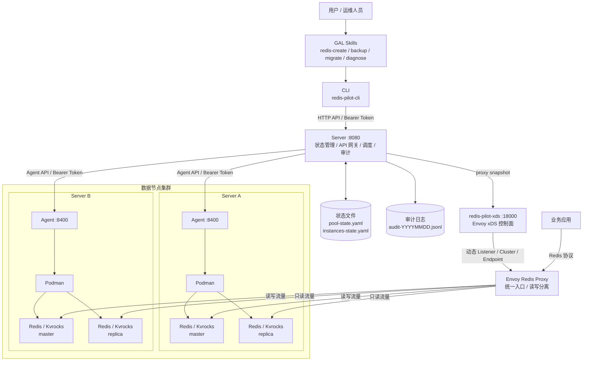

# Redis Pilot

轻量级 Redis/Kvrocks 多实例管理平台。通过 Server + Agent 架构集中管理分布在多台服务器上的 Redis 和 Kvrocks 容器实例，提供创建、主从复制、自动备份、故障转移、读写分离代理等能力，替代手动 SSH 逐台操作的运维方式。

## 特性

- 单点 & 主从实例创建、配置、删除
- 服务器节点化与智能调度（跨可用区分布）
- Envoy Redis Proxy 读写分离
- 自动备份与恢复
- Sentinel 事件监听 + 定期 reconcile 的故障转移同步与状态自愈
- 完整审计日志
- 支持 Redis 5 / 6.2 / 7 和 Apache Kvrocks 2.15.0（版本由 Server 白名单统一管理）

## 架构



管理流量从 GAL Skills/CLI 进入 Server，再由 Server 调度到各节点 Agent 执行 Podman 容器操作；业务流量不经过 Server，直接通过 Envoy Redis Proxy 访问后端 Redis/Kvrocks 实例。Server 是全局状态唯一写入点，`pool-state.yaml` 记录节点资源和 Agent 连接信息，`instances-state.yaml` 记录实例拓扑、端口、角色和备份配置。

| 组件 | 端口 | 职责 |
|------|------|------|
| Server | 8080 | 全局状态管理、API 网关、资源调度 |
| Agent | 8400 | 容器管理、健康检查、备份执行（每台服务器一个） |
| redis-pilot-xds | 18000 | 读取 Server 代理快照并向 Envoy 下发动态配置 |
| Envoy Proxy | 16379+ | 业务 Redis 协议入口，提供统一访问和读写分离 |
| CLI | - | 命令行工具，调用 Server API |

## 快速开始

### 编译

```bash
make all
# 产出: bin/redis-server  bin/redis-agent  bin/redis-cli
# redis-cli 部署时通常安装为 /usr/local/bin/redis-pilot-cli
```

### 启动 Server

```bash
mkdir -p /opt/redis-pilot-server/{state,audit,logs}
cp configs/server.yaml /opt/redis-pilot-server/server.yaml
bin/redis-server --config /opt/redis-pilot-server/server.yaml
```

### 启动 Agent（每台数据节点）

```bash
mkdir -p /opt/redis-pilot-agent/logs /data/redis
cp configs/agent.yaml /opt/redis-pilot-agent/agent.yaml
bin/redis-agent --config /opt/redis-pilot-agent/agent.yaml
```

### 注册服务器 & 创建实例

```bash
# 注册服务器到节点
redis-pilot-cli node add server-a --endpoint 10.0.1.10 --cpu 16 --memory 64Gi

# 创建单点缓存实例
redis-pilot-cli instance create my-cache --group cache --engine redis --memory 2Gi

# 创建主从持久化实例
redis-pilot-cli instance create my-order --group order --engine kvrocks --memory 4Gi --type replication

# 查看状态
redis-pilot-cli instance list
redis-pilot-cli instance status my-cache
```

## 项目结构

```
├── cmd/
│   ├── server/          # Server 入口
│   ├── agent/           # Agent 入口
│   └── cli/             # CLI 入口
├── internal/
│   ├── server/          # Server: API handler、调度、代理层状态快照
│   ├── xds/             # redis-pilot-xds: Envoy xDS 控制面
│   ├── agent/           # Agent: 容器管理、健康检查、配置模板
│   ├── state/           # YAML 状态文件读写 + 文件锁
│   ├── audit/           # 审计日志（JSONL）
│   ├── podman/          # Podman API 封装
│   └── logger/          # 日志
├── pkg/apitypes/        # Server ↔ Agent 共享类型
├── configs/             # 配置文件示例
└── docs/                # 文档
```

## 配置

### Server (`server.yaml`)

```yaml
port: 8080
token: ""                    # Bearer Token，空则不鉴权
data_dir: /opt/redis-pilot-server/state
ports:
  redis:          { start: 6379,  end: 6499  }
  envoy_auto:     { start: 16379, end: 16499 }
  envoy_master:   { start: 16500, end: 16619 }
images:
  redis:
    default: "7"
    versions:
      "5": docker.io/redis:5
      "6.2": docker.io/redis:6.2
      "7": docker.io/redis:7
  kvrocks:
    default: "2.15.0"
    versions:
      "2.15.0": docker.io/apache/kvrocks:2.15.0
log:
  dir: /opt/redis-pilot-server/logs
  stdout: true
```

### XDS (`xds.yaml`)

```yaml
listen: 0.0.0.0:18000
server:
  endpoint: http://127.0.0.1:8080
  token: ""
poll:
  interval: 2s
  timeout: 1s
envoy:
  node_ids:
    - redis-pilot-envoy
```

Envoy 只保留 bootstrap 配置并连接 `redis-pilot-xds`，业务 Listener、Cluster、Endpoint 由 xDS 动态下发。

### Agent (`agent.yaml`)

```yaml
port: 8400
token: ""
data_dir: /data/redis
log:
  dir: /opt/redis-pilot-agent/logs
  stdout: true
```

### CLI (`~/.redis-pilot-cli/config.yaml`)

```yaml
server: 127.0.0.1:8080
token: ""
```

## CLI 命令参考

```bash
# 节点
redis-pilot-cli node list
redis-pilot-cli node add <name> --endpoint <ip> --cpu <cores> --memory <size>
redis-pilot-cli node remove <name>
redis-pilot-cli node update <name> --json <server.json>

# 实例
redis-pilot-cli instance list
redis-pilot-cli instance status <name>
redis-pilot-cli instance create <name> --group <group> [--engine redis|kvrocks] [--memory 2Gi] [--type standalone|replication]
redis-pilot-cli instance delete <name> [--clean-data]
redis-pilot-cli instance start <name>
redis-pilot-cli instance stop <name>
redis-pilot-cli instance config <name> --set key=value[,key=value] [--restart]
redis-pilot-cli instance promote <name>
redis-pilot-cli instance replicate <replica> --replica-of <master>

# 备份
redis-pilot-cli backup exec <instance>
redis-pilot-cli backup list <instance>
redis-pilot-cli backup restore <instance> --backup-ts <timestamp>
redis-pilot-cli backup set-schedule <instance> --cron "0 2 * * *" --retention 7

# Sentinel
redis-pilot-cli sentinel status
redis-pilot-cli sentinel sync
```

## 文档

- [部署文档](docs/DEPLOYMENT.md) — 完整的生产部署指南
- [架构设计](ARCHITECTURE.md) — 详细设计文档
- [快速参考](docs/QUICK_REFERENCE.md)
- [实施清单](docs/IMPLEMENTATION_CHECKLIST.md)

## 技术栈

- Go 1.25 / Gin
- Podman（容器运行时）
- Envoy Redis Proxy（读写分离）
- YAML（状态存储）

## License

Internal use only.
